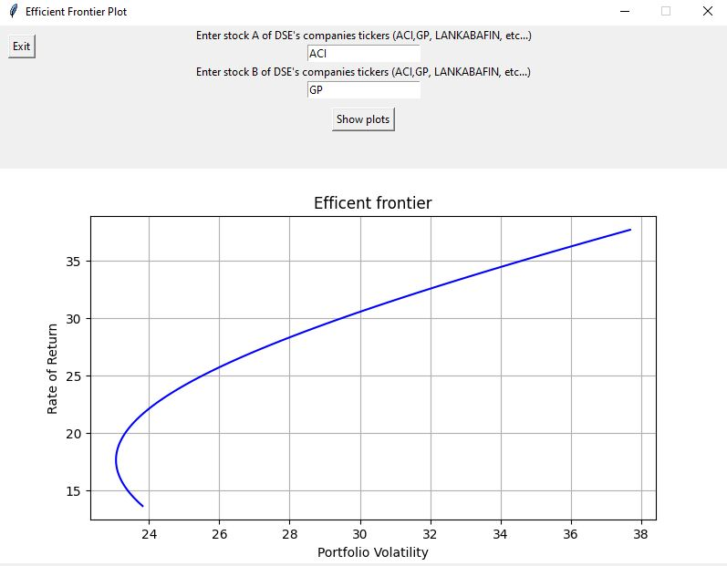

# Efficient_frontier_DSE_plot_Tkinker
Plotting efficient portfolio of portfolio return and risk between two stocks in Dhaka Stock Exchange(DSE). Retrieved stock  price data from bdshare library

# Libraries used are:
•	Tkinter
•	Pandas
•	Matplotlib
•	Bdshare
•	Numpy

  

